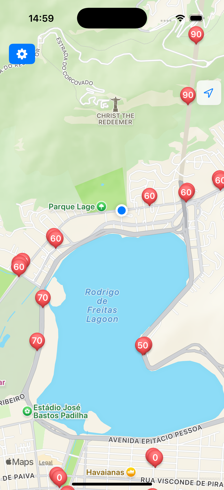

# RadarMaps

RadarMaps provides instant audio alerts for approaching traffic radars and speed cameras, but also lets you view all detected locations on a comprehensive, easy-to-read map, giving you full awareness of your route

<table>
  <td>
    </img>
  </td>
  <td>
    </img>
  </td>
</table>
